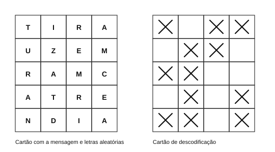
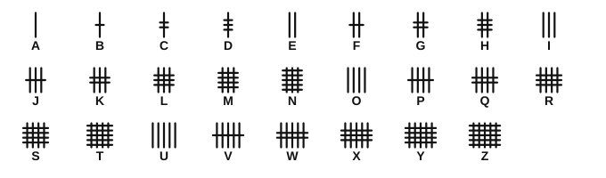
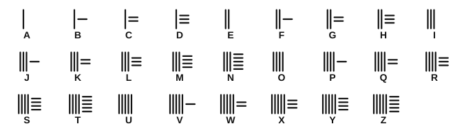
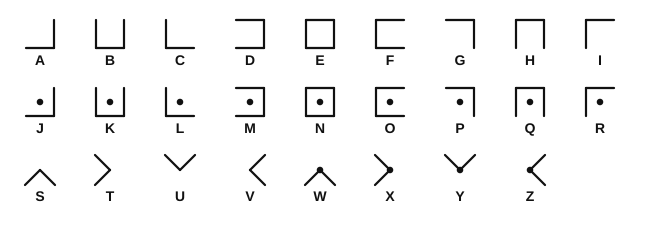
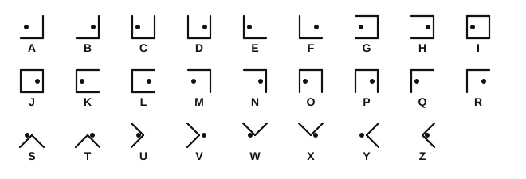
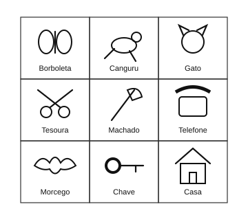

# Mini Manual de Técnica Escutista - Sinais, Cifras e Códigos

Edição digital em Markdown do conteúdo fornecido do *Mini Manual de Técnica Escutista*.

> **Nota editorial:** esta versão procura preservar a redação, os exemplos e a organização do manual. As tabelas foram convertidas para Markdown e alguns esquemas gráficos foram recriados em SVG para manter a legibilidade em formato digital.

## Índice

1. [Código Braille (Falso)](#código-braille-falso)
2. [Data](#data)
3. [Alfabeto Invertido](#alfabeto-invertido)
4. [Transposto](#transposto)
5. [Passa Um Melro](#passa-um-melro)
6. [Passa Dois Melros](#passa-dois-melros)
7. [Alfabeto Numeral](#alfabeto-numeral)
8. [Alfabeto Numeral com Chave](#alfabeto-numeral-com-chave)
9. [Romano-Árabe](#romano-árabe)
10. [Metades](#metades)
11. [Grelha](#grelha)
12. [Vogais por Pontos](#vogais-por-pontos)
13. [Caranguejo](#caranguejo)
14. [Frase 1](#frase-1)
15. [Frase 2](#frase-2)
16. [Chave +3](#chave-3)
17. [Código Chinês 1](#código-chinês-1)
18. [Código Chinês 2](#código-chinês-2)
19. [Angular 1](#angular-1)
20. [Angular 2](#angular-2)
21. [Última Letra Falsa](#última-letra-falsa)
22. [Batalha Naval com Chave](#batalha-naval-com-chave)
23. [Batalha Naval sem Chave](#batalha-naval-sem-chave)
24. [Mensagens Invisíveis](#mensagens-invisíveis)
25. [Caracol](#caracol)
26. [Primeira Letra Falsa](#primeira-letra-falsa)
27. [Palavra-Chave 1](#palavra-chave-1)
28. [Palavra-Chave 2](#palavra-chave-2)
29. [Palavra-Chave 3](#palavra-chave-3)
30. [Palavras Seguidas](#palavras-seguidas)
31. [Palavras Divididas](#palavras-divididas)
32. [Tabela de Figuras](#tabela-de-figuras)
33. [Código Braille](#código-braille)

---

# Código Braille (Falso)

## Descrição

O Código Braille Falso é feito do seguinte modo: distribuem-se as letras do alfabeto por 3 quadrados, cada um dos quais com nove letras, em 3 linhas e 3 colunas. Esta distribuição é necessária tanto para codificar como para descodificar mensagens. Cada letra é representada por um conjunto de pontos, em 3 linhas.

Na 1.ª linha, o número de pontos corresponde ao número do quadrado onde está a letra; na 2.ª linha corresponde ao número da linha onde está a letra nesse quadrado e na 3.ª ao número da coluna.

## Esquema

| Quadrado 1 |   |   |
|---|---|---|
| A | B | C |
| D | E | F |
| G | H | I |

| Quadrado 2 |   |   |
|---|---|---|
| J | K | L |
| M | N | O |
| P | Q | R |

| Quadrado 3 |   |   |
|---|---|---|
| S | T | U |
| V | W | X |
| Y | Z |   |

## Exemplo

No exemplo do manual, a letra **P** é representada por:
- 2 pontos na 1.ª linha: 2.º quadrado;
- 3 pontos na 2.ª linha: 3.ª linha;
- 1 ponto na 3.ª linha: 1.ª coluna.

São também apresentados os exemplos gráficos das letras **F** e **T**.

---

# Data

## Descrição

O código Data é feito com uma tabela em que na coluna mais à esquerda se coloca uma data (a data chave do código, que neste exemplo é 1984). Cada letra é composta de dois algarismos: o 1.º corresponde à linha e o 2.º à coluna. A mensagem codificada é escrita com os algarismos todos juntos.

## Esquema

|   | 1 | 2 | 3 | 4 | 5 | 6 | 7 | 8 | 9 | 0 |
|---|---|---|---|---|---|---|---|---|---|---|
| **1** | A | B | C | D | E | F | G | H | I | J |
| **9** | K | L | M | N | O | P | Q | R | S | T |
| **8** | U | V | W | X | Y | Z | 0 | 1 | 2 | 3 |
| **4** | 4 | 5 | 6 | 7 | 8 | 9 |   |   |   |   |

## Exemplo

```text
C = 13
R = 98
V = 82
ALERTA = 119215989011
```

---

# Alfabeto Invertido

## Descrição

Por baixo do alfabeto normal, escreve-se o mesmo alfabeto, mas invertido. As letras de baixo são a codificação das de cima.

## Esquema

| A | B | C | D | E | F | G | H | I | J | K | L | M | N | O | P | Q | R | S | T | U | V | W | X | Y | Z |
|---|---|---|---|---|---|---|---|---|---|---|---|---|---|---|---|---|---|---|---|---|---|---|---|---|---|
| Z | Y | X | W | V | U | T | S | R | Q | P | O | N | M | L | K | J | I | H | G | F | E | D | C | B | A |

## Exemplo

```text
ESCUTEIRO = VHXFGVRIL
```

---

# Transposto

## Descrição

Por baixo do alfabeto normal, escreve-se mesmo o alfabeto, mas começando na letra chave do código que, neste exemplo, é a letra V (então A = V). As letras de baixo são a codificação das de cima.

## Esquema

| A | B | C | D | E | F | G | H | I | J | K | L | M | N | O | P | Q | R | S | T | U | V | W | X | Y | Z |
|---|---|---|---|---|---|---|---|---|---|---|---|---|---|---|---|---|---|---|---|---|---|---|---|---|---|
| V | W | X | Y | Z | A | B | C | D | E | F | G | H | I | J | K | L | M | N | O | P | Q | R | S | T | U |

## Exemplo

```text
ESCUTEIRO = ZNXPOZDMJ
```

---

# Passa Um Melro

## Descrição

O código «passa-um-melro» consiste em intercalar uma letra aleatória entre cada letra da mensagem que queremos codificar.

## Exemplo

Mensagem:

```text
CHAMAR O CHEFE PARA ACENDER O LUME
```

No manual, a mensagem é codificada intercalando uma letra aleatória entre cada letra da mensagem original.

---

# Passa Dois Melros

## Descrição

O código «passa-dois-melros» consiste em intercalar duas letras aleatórias entre cada letra da mensagem que queremos codificar.

## Exemplo

Mensagem:

```text
JANTAR AS FEBRAS
```

Mensagem codificada:

```text
JIMASUNAETIMASRRAS AMISSU FRIEMIBURRINATOSAS
```

```text
(JIMASUNAETIMASRRAS AMISSU FRIEMIBURRINATOSAS)
```

## Notas

Podem ser usados outros códigos do género, como por exemplo «passa-três-melros», colocando simplesmente as 3 letras aleatórias entre as letras da mensagem.

---

# Alfabeto Numeral

## Descrição

A cada letra do alfabeto corresponde um número, de 1 a 26, pela ordem normal.

## Esquema

| A | B | C | D | E | F | G | H | I | J | K | L | M | N | O | P | Q | R | S | T | U | V | W | X | Y | Z |
|---|---|---|---|---|---|---|---|---|---|---|---|---|---|---|---|---|---|---|---|---|---|---|---|---|---|
| 01 | 02 | 03 | 04 | 05 | 06 | 07 | 08 | 09 | 10 | 11 | 12 | 13 | 14 | 15 | 16 | 17 | 18 | 19 | 20 | 21 | 22 | 23 | 24 | 25 | 26 |

## Exemplo

```text
ESCUTEIRO = 051903212005091815
```

ou

```text
05 19 03 21 20 05 09 18 15
```

---

# Alfabeto Numeral com Chave

## Descrição

A cada letra do alfabeto corresponde um número. Para identificar o código é preciso dar a chave. Se, por exemplo, a chave do código for 12, podemos fazer uma tabela de conversão.

## Esquema

| A | B | C | D | E | F | G | H | I | J | K | L | M | N | O | P | Q | R | S | T | U | V | W | X | Y | Z |
|---|---|---|---|---|---|---|---|---|---|---|---|---|---|---|---|---|---|---|---|---|---|---|---|---|---|
| 12 | 13 | 14 | 15 | 16 | 17 | 18 | 19 | 20 | 21 | 22 | 23 | 24 | 25 | 26 | 27 | 28 | 29 | 30 | 31 | 32 | 33 | 34 | 35 | 36 | 37 |

## Exemplo

```text
ALERTA = 12 23 16 29 31 12
```

---

# Romano-Árabe

## Descrição

As vogais são numeradas em romano, e as consoantes em árabe.

## Esquema

| A | E | I | O | U |
|---|---|---|---|---|
| I | II | III | IV | V |

| B | C | D | F | G | H | J | K | L | M | N | P | Q | R | S | T | V | W | X | Y | Z |
|---|---|---|---|---|---|---|---|---|---|---|---|---|---|---|---|---|---|---|---|---|
| 1 | 2 | 3 | 4 | 5 | 6 | 7 | 8 | 9 | 10 | 11 | 12 | 13 | 14 | 15 | 16 | 17 | 18 | 19 | 20 | 21 |

## Exemplo

```text
ALERTA = I 9 II 14 16 I
```

---

# Metades

## Descrição

As letras da mensagem são dispostas alternadamente numa tabela de duas colunas. Vamos dar o exemplo da seguinte mensagem:

```text
CHAMAR O SOCORRISTA
```

Construímos a tabela.

O número total de letras a inscrever na tabela deve ser sempre par, pelo que, se a mensagem tiver um número ímpar de letras, deve acrescentar-se uma letra qualquer no final.

Agora escrevemos a mensagem codificada lendo primeiro a primeira linha e depois a segunda linha.

Para decifrar, divide-se a mensagem ao meio e constrói-se a tabela.

## Esquema

| C |   | A |   | A |   | O |   | O |   | O |   | R |   | S |   | A |
|---|---|---|---|---|---|---|---|---|---|---|---|---|---|---|---|---|
|   | H |   | M |   | R |   | S |   | C |   | R |   | I |   | T |   |

## Exemplo

```text
Mensagem cifrada: CAAOOORSAHMRSCRIT
```

---

# Grelha

## Descrição

Mensagem:

```text
TRAZER A TENDA
```

A mensagem para codificar é escrita num cartão quadriculado, intercalando letras aleatórias entre as letras da mensagem.

Para decifrar a mensagem, fazemos outro cartão quadriculado, igual, marcando cruzes nas quadrículas correspondentes ao sítio das letras da mensagem.

Este cartão de descodificação pode ser ainda feito da seguinte maneira: em vez de marcar com um X as quadrículas correspondentes, recortam-se essas quadrículas, com um canivete; depois, é só sobrepor os dois cartões, e os buracos abertos deixarão ver as letras da mensagem.

## Esquema



---

# Vogais por Pontos

## Descrição

As vogais são todas substituídas por pontos.

## Exemplo

```text
SEMPRE ALERTA = S.MPR. .L.RT.
```

---

# Caranguejo

## Descrição

As letras e as palavras são escritas ao contrário.

## Exemplo

```text
BOA CAÇA E SEMPRE ALERTA = ATRELA ERPMES E AÇAC AOB
```

---

# Frase 1

## Descrição

Cada letra da mensagem é utilizada para começar uma palavra de uma frase. Este código requer um bocado de imaginação, de maneira a que a frase final (com a mensagem codificada) pareça uma frase com algum sentido, ou pelo menos que leve o descodificador a pensar que se trata de alguma espécie de enigma, e não numa mensagem codificada.

## Exemplo

```text
ESCUTA = ERGAM SACOS COM UVAS TODAS AMARELAS
```

---

# Frase 2

## Descrição

Idêntico ao «Frase 1», mas usa-se a segunda letra de cada palavra. No caso dos artigos definidos («o» e «a») passa-se à frente. Pode criar-se o «Frase 3», usando a mesma metodologia.

---

# Chave +3

## Descrição

Cada letra do alfabeto corresponde à letra que está 3 posições à frente no alfabeto. Podemos então fazer uma tabela.

## Esquema

| A | B | C | D | E | F | G | H | I | J | K | L | M | N | O | P | Q | R | S | T | U | V | W | X | Y | Z |
|---|---|---|---|---|---|---|---|---|---|---|---|---|---|---|---|---|---|---|---|---|---|---|---|---|---|
| D | E | F | G | H | I | J | K | L | M | N | O | P | Q | R | S | T | U | V | W | X | Y | Z | A | B | C |

Assim, A=D, B=E, etc.

## Exemplo

```text
ESCUTA = HVFXWD
```

## Notas

Este código pode ter inúmeras variações: +2; +5; -3; -4; etc., sendo que «-3» significa 3 posições atrás no alfabeto.

---

# Código Chinês 1

## Descrição

Esta cifra é escrita apenas com traços horizontais e verticais. A cada traço vertical corresponde uma vogal.

As consoantes são indicadas por traços horizontais sobrepostos aos verticais. Para escrever uma consoante, começa-se pela vogal imediatamente anterior (no alfabeto) e, por cima dos traços verticais dessa vogal, colocam-se tantos traços horizontais quanto o número de letras entre a vogal e a consoante.

Por exemplo, para a letra P, começamos pela vogal anterior que é o O (IIII). Ora, como entre o P e o O a distância é de uma letra, apenas colocamos um traço horizontal sobre os 4 traços verticais da letra O.

## Esquema



---

# Código Chinês 2

## Descrição

Esta cifra é escrita apenas com traços horizontais e verticais. A cada traço vertical corresponde uma vogal.

As consoantes são indicadas por traços horizontais escritos ao lado dos verticais. Para escrever uma consoante, começa-se pela vogal imediatamente anterior (no alfabeto) e, ao lado dos traços verticais dessa vogal, colocam-se tantos traços horizontais quanto o número de letras entre a vogal e a consoante.

Por exemplo, para a letra P, começamos pela vogal anterior que é o O (IIII). Ora, como entre o P e o O a distância é de uma letra, apenas colocamos um traço horizontal ao lado dos 4 traços verticais da letra O. Deve ser deixado algum espaço entre as letras para evitar confusão entre os traços de cada uma.

## Esquema



---

# Angular 1

## Descrição

Este código usa símbolos angulares (90º) e pontos, retirados do esquema de codificação. O símbolo angular é representado pelas linhas que rodeiam a letra, com ou sem ponto.

Por exemplo, a diferença entre a letra S e a letra W é que esta possui um ponto enquanto a outra não. A ordem de disposição das letras é fixa e, no caso das duas cruzes, começa em cima e segue o sentido dos ponteiros do relógio.

## Esquema



## Exemplo

O manual apresenta exemplos gráficos para:

```text
ALERTA
```

e

```text
SUZY
```

---

# Angular 2

## Descrição

Este código usa símbolos angulares (90º) e pontos, retirados do esquema de codificação. O símbolo angular é representado pelas linhas que rodeiam a letra e por um ponto que indica a posição relativa entre as linhas. Por exemplo as letras A e B usam as mesmas linhas, mas o A tem um ponto mais à esquerda e o B um ponto mais à direita, devido às suas posições.

No caso da cruz, começa em cima à esquerda e segue o sentido dos ponteiros do relógio.

## Esquema



## Exemplo

O manual apresenta exemplos gráficos para:

```text
ALERTA
```

e

```text
SUZY
```

---

# Última Letra Falsa

## Descrição

A última letra de cada palavra da mensagem codificada é falsa, por isso, para descodificar, basta eliminar as últimas letras. Para dificultar ainda mais, podem-se cortar as palavras ao meio.

## Exemplo

```text
AS TENDAS FICAM MONTADAS JUNTO AO RIO
```

```text
ASO TENDO ASO FIM CAME MONA TADASE JUL NTOU AOR RIOP
```

```text
(ASO TENDO ASO FIM CAME MONA TADASE JUL NTOU AOR RIOP)
```

---

# Batalha Naval com Chave

## Descrição

É feita uma tabela estilo Batalha Naval, 5 linhas por 5 colunas, onde as letras do alfabeto são dispostas ordenadamente, começando na letra a seguir à letra-chave. Por exemplo, se a letra-chave for «J», essa letra não é escrita nem pode ser codificada, e começa-se a preencher a tabela com a letra seguinte, «K».

## Esquema

|   | A | B | C | D | E |
|---|---|---|---|---|---|
| **1** | K | L | M | N | O |
| **2** | P | Q | R | S | T |
| **3** | U | V | W | X | Y |
| **4** | Z | A | B | C | D |
| **5** | E | F | G | H | I |

Assim:

```text
A=B4 ; T=E2 ; C=D4 ; etc.
```

## Exemplo

```text
CHAMAR A JOANA =
D4 D5 B4 C1 B4 C2 B4 ... E1 B4 D1 B4
```

---

# Batalha Naval sem Chave

## Descrição

É feita uma tabela estilo Batalha Naval, com o mesmo número de linhas e de colunas, que fica ao critério da pessoa que codifica. As letras usadas na mensagem são dispostas aleatoriamente na tabela, misturadas com outras letras que não têm nada a ver com a mensagem. Para descodificar é preciso, obrigatoriamente, ter uma tabela igual à que o codificador usou. As letras são codificadas, então, fazendo referência às quadrículas respetivas.

## Esquema

|   | A | B | C | D | E | F |
|---|---|---|---|---|---|---|
| **1** | A | C | E | R | A | M |
| **2** | C | H | U | N | G | A |
| **3** | N | E | L | J | I | O |
| **4** | C | I | A | N | V | U |
| **5** | R | A | T | A | X | U |
| **6** | A | L | O | Q | U | M |

## Exemplo

```text
CHAMAR A JOANA =
B1 B2 E1 F6 E1 A5 E1 D3 C6 E1 A3 E1
```

---

# Mensagens Invisíveis

## Descrição

Usa-se uma «tinta» especial, invisível, que não deixa marca no papel. As «tintas» mais usadas são o sumo de limão, o sumo de batata, o leite e o sabão. Escreve-se com um pincel fino, ou com a cabeça de um fósforo, para evitar que o papel fique marcado. Para ler, basta aproximar o papel de uma fonte de calor (vela, fósforo, fogueira, etc.) e as letras ficarão visíveis. Cuidado para não queimares o papel.

---

# Caracol

## Descrição

O código caracol precisa de uma chave, tanto para codificar, como para descodificar, e que é simplesmente um número. Este número corresponde à altura (e largura) da tabela.

Vamos dar o exemplo de um Caracol 6, uma mensagem que queremos codificar. O número de letras da mensagem a codificar tem de ser sempre igual ou inferior ao quadrado da chave, neste caso, a mensagem tem de ter menos de 36 (6x6) letras. Mas uma mensagem com 24 ou 25 letras não deveria ser escrita com Caracol 6, mas sim com Caracol 5 (5x5=25).

As letras são dispostas em caracol, no sentido contrário aos ponteiros do relógio. Os espaços que sobram devem ser preenchidos com letras ao acaso.

A mensagem cifrada é, então, obtida lendo normalmente na horizontal.

Para decifrar, contamos quantas letras têm a mensagem, e achamos a raiz quadrada, para sabermos quantas letras de largura tem a tabela. A seguir, dispomos as letras na tabela, e depois lemos em caracol.

## Exemplo

```text
ACAMPAMENTO JUNTO AO RIO COM FOGUEIRA = 
AIROAOCOARITACLAENMOTUUUPMFOGJAMENTO
```

## Esquema da tabela

| A | I | R | O | A | O |
| C | O | A | R | I | T |
| A | C | L | A | E | N |
| M | O | T | U | U | U |
| P | M | F | O | G | J |
| A | M | E | N | T | O |

---

# Primeira Letra Falsa

## Descrição

A primeira letra de cada palavra da mensagem codificada é falsa, por isso, para descodificar, basta eliminar as primeiras letras. Para dificultar ainda mais, podem-se cortar as palavras ao meio.

## Exemplo

```text
AS TENDAS FICAM MONTADAS JUNTO AO RIO
```

```text
LAS ATEN UDAS AFIC RAM SMON ATADAS AJU ONTO NAOR BIO
```

```text
(LAS ATEN UDAS AFIC RAM SMON ATADAS AJU ONTO NAOR BIO)
```

---

# Palavra-Chave 1

## Descrição

Escolhe-se uma palavra-chave, que não deve ter qualquer significado. Coloca-se uma letra desta chave entre cada duas letras da mensagem.

## Exemplo

Exemplo de palavra-chave:

```text
SHZUMJB
```

Mensagem:

```text
A PISTA COMEÇA NO LARGO
```

Cifrada:

```text
ASPHIZSUTMAJCBOSMHEZÇUAMNJOBLSAHRZGUOM
```

Para decifrar, cortam-se as letras da palavra-chave.

---

# Palavra-Chave 2

## Descrição

Escolhe-se uma palavra ou frase curta para servir de chave.

Exemplo de chave:

```text
SEMPRE ALERTA
```

1.º passo - Escrever a chave, mas retirando as letras repetidas.

```text
SEMPRE ALERTA > SEMPRALT
```

2.º passo - Escrever uma linha de 13 letras, começando com as letras obtidas e continuando com a sequência do alfabeto, desde o seu início, sem nunca repetir uma letra.

```text
SEMPRALT > SEMPRALTBCDFG
```

3.º passo - Completar uma segunda linha com 13 letras, com as restantes letras do alfabeto, sem nunca repetir letras.

## Esquema

| S | E | M | P | R | A | L | T | B | C | D | F | G |
|---|---|---|---|---|---|---|---|---|---|---|---|---|
| H | I | J | K | N | O | Q | U | V | W | X | Y | Z |

Com esta tabela, pode começar-se a cifrar ou decifrar a mensagem, sendo que as letras de cima correspondem às de baixo e vice-versa (A=O, S=H, D=X, etc.).

## Exemplo

```text
ESCUTEIRO = IHWTUINA
```

## Notas

No caso de a chave ser uma frase grande e no 1.º passo ainda sobrarem letras, continua-se na segunda linha.

---

# Palavra-Chave 3

## Descrição

Escolhe-se uma palavra ou frase curta para servir de chave.

Exemplo de chave:

```text
BROWNSEA
```

Escreve-se a chave numa tabela, mas retirando as letras repetidas.

Por baixo, continua-se com a sequência do alfabeto, desde o seu início, sem nunca repetir uma letra.

## Esquema

| B | R | O | W | N | S | E | A |
|---|---|---|---|---|---|---|---|
| C | D | F | G | H | I | J | K |
| L | M | P | Q | T | U | V | X |
| Y | Z |   |   |   |   |   |   |

De seguida, faz-se uma nova tabela, escrevendo na primeira linha a sequência de colunas da tabela anterior (começando de cima para baixo e da direita para a esquerda). Na segunda linha, escrevem-se todas as letras do alfabeto, por ordem. Para decifrar também é necessário construir estas tabelas.

| B | C | L | Y | R | D | M | Z | O | F | P | W | G | Q | N | H | T | S | I | U | E | J | V | A | K | X |
|---|---|---|---|---|---|---|---|---|---|---|---|---|---|---|---|---|---|---|---|---|---|---|---|---|---|
| A | B | C | D | E | F | G | H | I | J | K | L | M | N | O | P | Q | R | S | T | U | V | W | X | Y | Z |

As letras de cima correspondem às de baixo (C=L, E=R, O=N). Para cifrar, procuramos a letra que queremos na linha de baixo e usamos a de cima. Para decifrar, procuramos a letra em cima e usamos a de baixo.

## Exemplo

```text
ESCUTEIRO = RILEUROSN
```

---

# Palavras Seguidas

## Descrição

As palavras são escritas seguidas, sem os espaços que normalmente as separam.

## Exemplo

```text
SAIR DO CAMPO ÀS NOVE HORAS E PROCURAR O CHEFE À PORTA DA IGREJA = SAIRDOCAMPOÀSNOVEHORASEPROCURAROCHEFEÀPORTADAIGREJA
```

---

# Palavras Divididas

## Descrição

As palavras da mensagem são divididas em grupos diferentes dos originais, dificultando a identificação imediata das palavras.

## Exemplo

```text
SAIR DO CAMPO ÀS NOVE HORAS E PROCURAR O CHEFE À PORTA DA IGREJA = SA IRDOC AMPO ÀSNO VEHO RASEPRO CUR AROCH EFEÀ PO RTAD AIG REJA
```

---

# Tabela de Figuras

## Descrição

Faz-se uma tabela com várias figuras, as quais possam facilmente ser identificadas. Para escrever a mensagem, espalha as sílabas dos nomes das figuras entre as sílabas das palavras do texto, sem deixares espaços. Para decifrar, é necessário conhecer o quadro, e, depois, basta riscar as sílabas dos nomes das figuras.

## Esquema



## Exemplo

```text
AOBORLABODOLETADACANFONGUTERUESGATÁTOUMTEENVE
SOURALOMARPECOMTEMETALODETEDASLECOORDEFONANE
DASMOREAECOUGOTRACHAMEVETADECANATENSADA
```

---

# Código Braille

## Descrição

O manual apresenta o alfabeto Braille de A a Z.

## Esquema

| Letra | Braille | Letra | Braille |
|---|---|---|---|
| A | ⠁ | N | ⠝ |
| B | ⠃ | O | ⠕ |
| C | ⠉ | P | ⠏ |
| D | ⠙ | Q | ⠟ |
| E | ⠑ | R | ⠗ |
| F | ⠋ | S | ⠎ |
| G | ⠛ | T | ⠞ |
| H | ⠓ | U | ⠥ |
| I | ⠊ | V | ⠧ |
| J | ⠚ | W | ⠺ |
| K | ⠅ | X | ⠭ |
| L | ⠇ | Y | ⠽ |
| M | ⠍ | Z | ⠵ |
